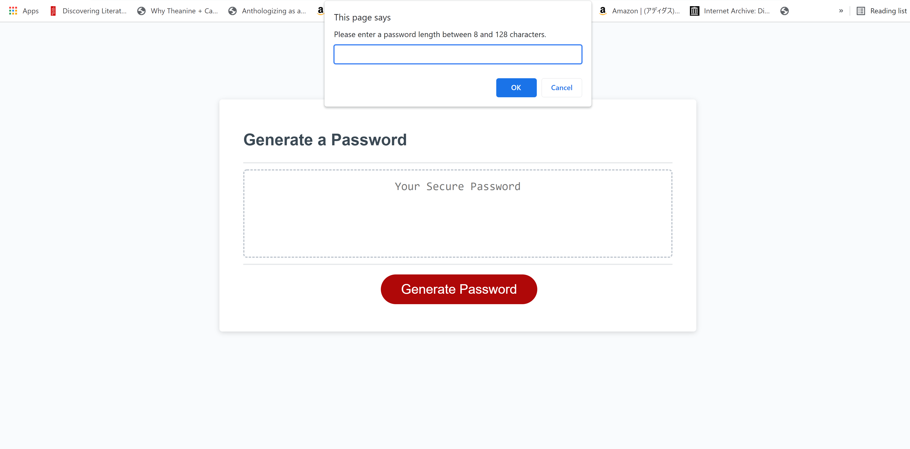
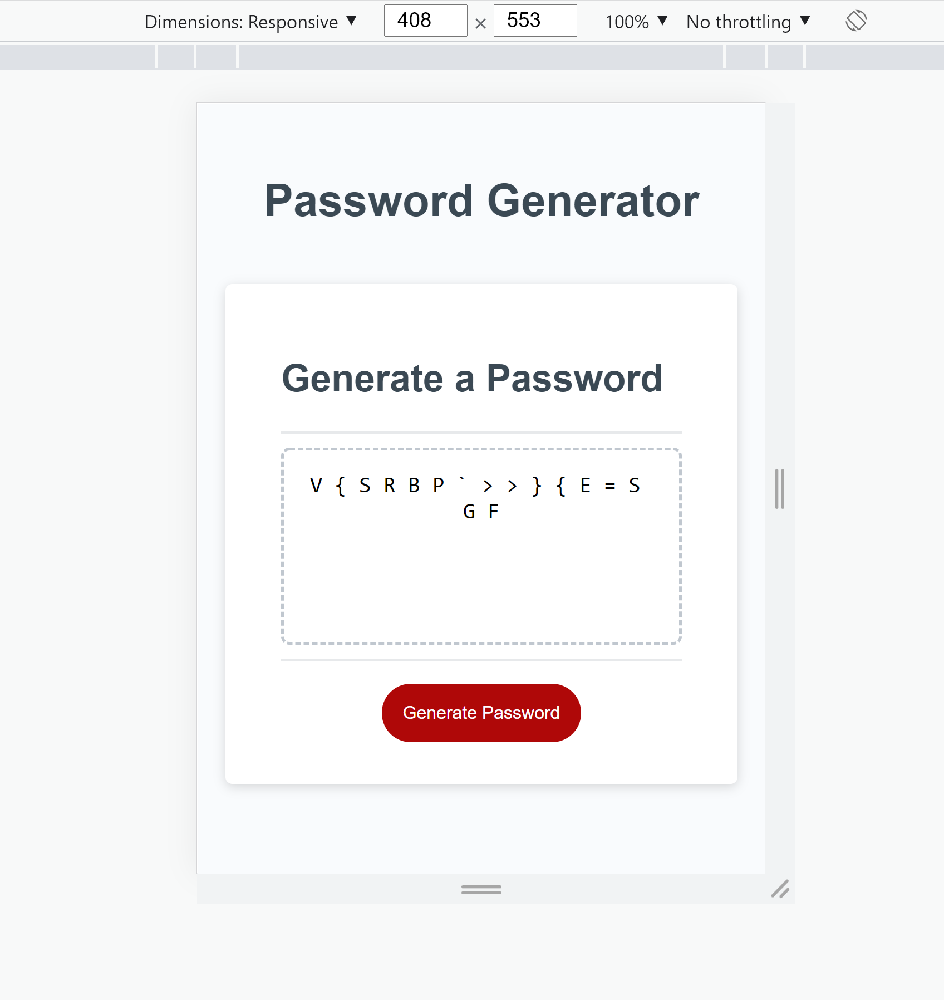
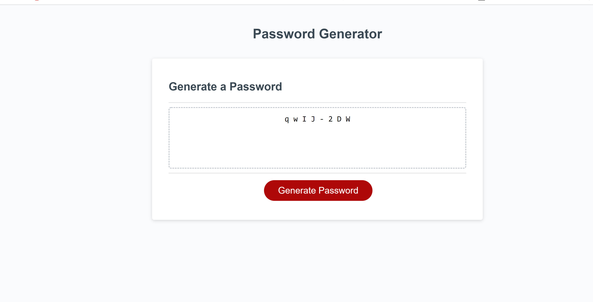

# Password-Generator

## Introduction:

This is a password generator I helped make using JavaScript. The HTML and CSS as well as a little bit of
starter JavaScript were provided to me. This project is
compatible with smartphones, tablets, and laptops. I spent a considerable amount of time playing with the logic.

## General Information:

In this project, I used JavaScript to make the password generator functional. Users can change the outcome of the 
randomly generated password based on certain criteria like numbers, uppercase letters, symbols, etc. They may also
select the length of their password from 8 to 126 characters.

 I used the following JavaScript tools:
1. Variables (implementation of ECMA2015 JS)
2. Functions (implementation of ECMA2015 JS)
3. Arrays
4. For Loops
5. Methods

## Screenshots:

## Built with:

1. Visual Studio Code
2. HTML
3. CSS
4. JavaScript
5. Chrome DevTools
6. A little bit of markdown

## GitPages Link:

https://mully7773.github.io/Password-Generator/

## Author:

Nick Mullenmeister